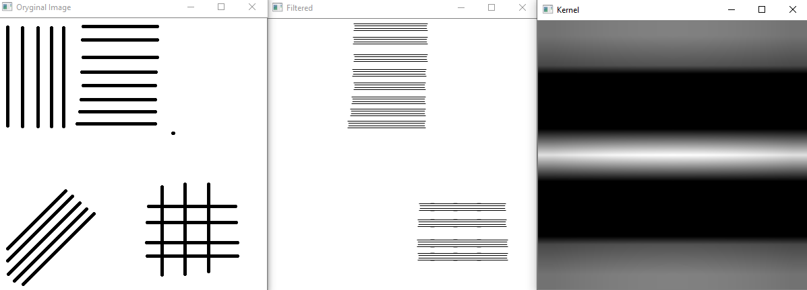
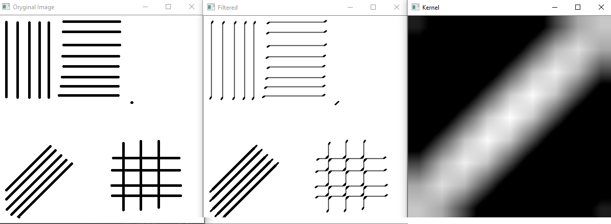
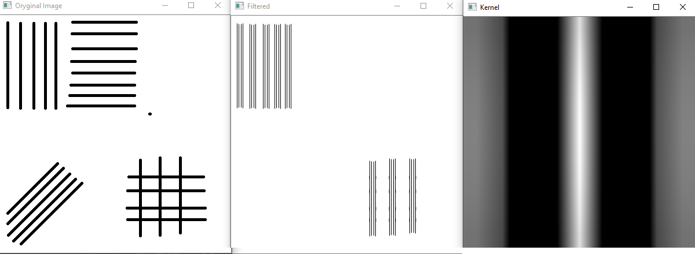
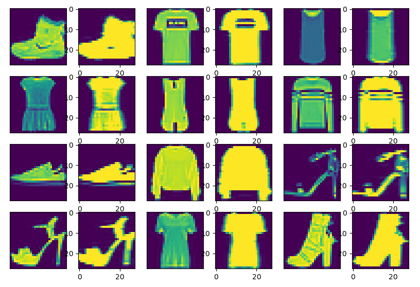
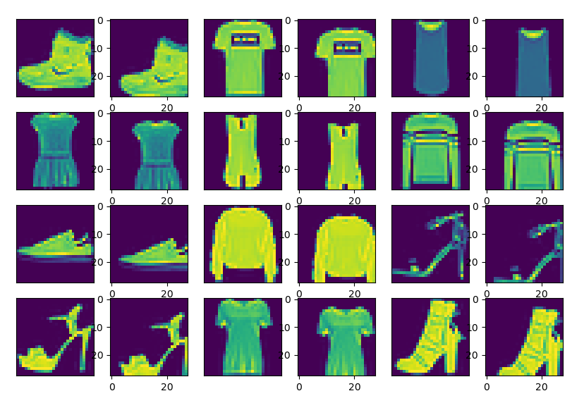
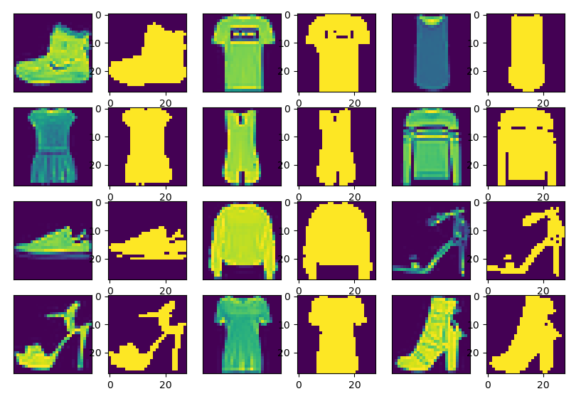

> Written with [StackEdit](https://stackedit.io/).
# Fashon-MNIST project
## Introduction
This project's first objective is to test one of previously implemented models using Fashion-MNIST dataset. I decided to test k-NN algoritm (k-nearest neighbors algorithm).
The second objective is to create my own implementation of model which would categorise clothes from Fashion-MNIST.

## Methods
### k-NN
The only problem with previous implementation of k-NN is that it uses **hamming distance metric** which is used to compare two **binary** pieces of information. Fashion-MNIST dataset contains grayscale images which, as you can see [here](https://github.com/zalandoresearch/fashion-mnist), are not discrete. In order to use algorithm witch this metric you have to preprocess images doing **binarization**. Obviously, the other solution is changing the metric. For example you can use **euclidean distance metric**.

In my research I'll try those two approaches to see, which will produce better results. Of course first approach depends on threshold used within binarization algorithm (simply if pixel value is greather then threshold it will become 1 else 0) so I'll try to find which is best for Fashion-MNIST dataset.

You can see source kod of k-NN implementation in **K_NN.py** file and tests in **K_NN_Tests.py**.
### My model
My model is sequential neural network model implemented using keras. 'Sequential' means, that neurons belong to layers - input layer, output layer and hidden layers between them. You could think of this model type as 'Hello World' of neural network machine learning. Each neuron is connected to all neurons from the previous layer and each connection has a weight. Basically, process of 'teaching' a model is a manipulation of those weights and biases used in their's activation functions.

While creating even simple sequential model you have to consider what function or functions you'll use as activation functions and how you want to initialize biases and weights. There are several function used commonly in deep learning as activation fuctions. Those are:

 - sigmoid function: 
 - ReLu: 
 - ReLu: 
 - Tanh

You can learn more about them by watching [Stanford university lectures](https://www.youtube.com/watch?v=wEoyxE0GP2M&list=PL3FW7Lu3i5JvHM8ljYj-zLfQRF3EO8sYv&index=6).
All of them have pros and cons, but as a rule of thumb you should never use sigmoid function and use ReLu instead. It's also possible to experiment with usage of other functions.

Those lectures also contain basic ideas how to initialize weights. The common solution is Xavier initialization (also known as Glorot initialization), however it woked well with sigmoid function not a ReLu function. You should use slightly modified version called he et al initialization.
(https://books.google.pl/books/about/Deep_Learning_with_Applications_Using_Py.html?id=5HNUDwAAQBAJ&source=kp_cover&redir_esc=y)
#### about model
 [Navin Kumar Manaswi](https://books.google.pl/books/about/Deep_Learning_with_Applications_Using_Py.html?id=5HNUDwAAQBAJ&source=kp_cover&redir_esc=y) says that there are eight steps to the deep learning process in Keras:
1. Load the data.
2. Preprocess the data.
3. Define the model.
4. Compile the model.
5. Fit the model.
6. Evaluate the model.
7. Make the predictions.
8. Save the model.

First of all you have to load the data. Next step is preprocessing of the data. It could be for example extracting futures using for example gabor filter or binarization of images. You could also increase size of training data by doing  image manipulation. After that you have to reshape data, so your model can use it.

Fundamental method of defining models is trial and error. That's why, in this project, my model is based of [one model from zalandor research github](https://github.com/zalandoresearch/fashion-mnist/blob/master/benchmark/convnet.py). I tried changing initialization of layers, theirs parameters and I added batch normalization layer ([here's why it could be a good idea](https://youtu.be/wEoyxE0GP2M?t=2934)) . **However the goal of this project is not to make the best model possible, but to see results of training set manipulation**. In order to do so, I tried applying gabor filter, binarizing of  and translating images by vector. You can see results in the Result section.

Before compiling, you have to chose optimizer for your model. I tried diffrent optimizers (trial and error method) and the best results (using only normalization and reshaping of data as preprocessing) produced adam optimizer. Adam optimizer is impementation of [SGD](https://en.wikipedia.org/wiki/Stochastic_gradient_descent).

The next step is training (fitting) your model. I used same amount of epchos and same batchsize as original model in order to make comparission of accuracy more reliable.
### Data set manipulation
#### Gabor filter
Gabor filter is a linear filter used for preprocessing images for deep learning. To visualise it's effects you can look at images below.

As you can see, gabor filter extracts features from image, however you have to know in which direction you want them extracted. **Fashon-MNIST contains only non rotated images**, so you can apply horizontal filter.

Below you can see Fashon-MNIST images before and after applying gabor filter.

#### Extending training set
It is possible to increase size of training set by applying small changes to images that won't change their classification. It's a common technique that should increase accuracy of model (if done correctly). As I mentioned before, Fashon-MNIST contains only non rotated images, so applying rotation is a bad idea. However you can still apply translation by vector.

Below you can see Fashon-MNIST images before and after applying translation by random vectors containing values from -3 to 3.

## Results

### k-NN with hamming metric
I [binarized](https://github.com/Pralkopodobny/najglebszyDeepLearningEverMade/blob/master/lab_4/preprocessing/binarizator.py) fashon-MNIST images with diffrent thresholds and I used [k-NN](https://github.com/Pralkopodobny/najglebszyDeepLearningEverMade/blob/master/lab_4/models/K_NN.py) model to classify them. You can see results in table below and sorce code of tests [here](https://github.com/Pralkopodobny/najglebszyDeepLearningEverMade/blob/master/lab_4/tests/KNN_tests.py).
| Threshold  | k_values | Acuraccy | Best k |
|--|--|--|--  |
| 0.1 | 3-9 | 0.8588 | 3 |
| 0.2 | 3-9 | 0.8528 | 5 |
| 0.3 | 3-9 | 0.8413 | 7 |
| 0.4 | 3-9 | 0.8217 | 5 |
| 0.5 | 3-9 | 0.7958 | 5 |
| 0.6 | 3-9 | 0.7641 | 7 |
| 0.7 | 3-9 | 0.716 | 9 |
| 0.8 | 3-9 | 0.6378 | 9 |
| 0.9 | 3-9 | 0.5244 | 7 |

As we can see the best results are with the smallest threshold.

### k-NN with euclidean metric
I normalized values of pixels to 0-1 range and I used model to classify them. You can see results in table below and sorce code of tests [here](https://github.com/Pralkopodobny/najglebszyDeepLearningEverMade/blob/master/lab_4/tests/KNN_tests.py).
| HH:MM:SS | k_values | Best Acuraccy  | best k
|--|--|--|--|
| 00:11:00 | 3-9 | 0.8527 | 3 |

### k-NN summary
If we compare our best models to [Zalandoresearch benchmark](http://fashion-mnist.s3-website.eu-central-1.amazonaws.com/) we can see, that our results are very similar. 

### my model with minimal preprocessing
I normalized images to range 0-1 and reshaped them. My model has better results then oryginal one (you can find sorce code of all tests  [here](https://github.com/Pralkopodobny/najglebszyDeepLearningEverMade/blob/master/lab_4/tests/my_model_test.py)).
|  | accuracy |
|--|--|
| **oryginal model** | 0.916 |
| **my model** | 0.9253 |

### my model with gabor filter
I used gabor filter ([sorce code](https://github.com/Pralkopodobny/najglebszyDeepLearningEverMade/blob/master/lab_4/preprocessing/gaborFilter.py)) to extract features from images (I got parameters of filter by trial and error). It resulted in small decrease of accuracy.
|  | accuracy |
|--|--|
| **my model without gabor filter preprocessing** | 0.9253 |
| **my model with gabor filter preprocessing** | 0.905 |

### my model with binarization
I used best threshold from k-NN research and binarized ([sorce code](https://github.com/Pralkopodobny/najglebszyDeepLearningEverMade/blob/master/lab_4/preprocessing/binarizator.py)) images. The results are not surprising: Binarization of image results in loss of information so model is not able to predict as good as it would without it.
|  | accuracy |
|--|--|
| **my model without binarization of images** | 0.9253 |
| **my model with binarization of images** | 0.8840 |

### my model with extension of training dataset
I translated ([sorce code](https://github.com/Pralkopodobny/najglebszyDeepLearningEverMade/blob/master/lab_4/preprocessing/translator.py)) images by a vector and added them to the training dataset. It didn't change accuracy too much, however during training process we could observe smaller diffrence between training accuracy and validation accuracy. It could mean that this method reduces [overfitting](https://en.wikipedia.org/wiki/Overfitting).
|  | accuracy |
|--|--|
| **my model without extension of training dataset** | 0.9253 |
| **my model with extension of training dataset** | 0.9271 |

## Usage
You need machine with python +3.6 and tensorflow, opencv, keras, numpy librarys installed. It is also recommended to download and enable CUDA on your machine ([tutorial](https://www.tensorflow.org/install/gpu)). You can run tests  by running [KNN_tests.py](https://github.com/Pralkopodobny/najglebszyDeepLearningEverMade/blob/master/lab_4/tests/KNN_tests.py) and [my_model_test.py](https://github.com/Pralkopodobny/najglebszyDeepLearningEverMade/blob/master/lab_4/tests/my_model_test.py) after cloning this git repository. If you want to use trained models you can load them from [files](https://github.com/Pralkopodobny/najglebszyDeepLearningEverMade/tree/master/lab_4/tests) using [this function](https://www.tensorflow.org/guide/keras/save_and_serialize).